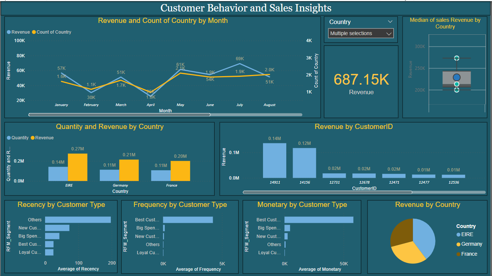

# BI-Dashboards-Portfolio
BI-Dashboards-Portfolio
# Customer Behavior and Sales Insights Dashboard



## Overview

This repository contains a Power BI dashboard designed to provide insights into customer behavior and sales performance. The dashboard visualizes key metrics and trends across various dimensions, offering a comprehensive view of revenue, customer segmentation, and sales dynamics.

  The RFM model helps in identifying the most valuable customers by evaluating:
  - **Recency:** How recently a customer has made a purchase.
  - **Frequency:** How often a customer makes a purchase.
  - **Monetary:** How much money a customer spends on purchases.
  - **Segments:** customers into different categories:
                  - Best Customers
                  - Big Spenders
                  - New Customers
                  - Loyal Customers
                  - Others

## Dashboard Highlights

### 1. Revenue and Count of Country by Month
- **Visual Type:** Line Chart
- **Insights:** Shows the monthly trend of revenue and the count of countries. Highlights fluctuations in revenue and country engagement over the months.

### 2. Quantity and Revenue by Country
- **Visual Type:** Bar Chart
- **Insights:** Compares the quantity of products sold and revenue generated across different countries. Provides a clear picture of top-performing regions.

### 3. Revenue by CustomerID
- **Visual Type:** Bar Chart
- **Insights:** Displays revenue contributions by individual customers, identifying key accounts and revenue distribution.

### 4. Median of Sales Revenue by Country
- **Visual Type:** Box Plot
- **Insights:** Presents the distribution of sales revenue across countries, showcasing median values and outliers.

### 5. Recency, Frequency, and Monetary (RFM) Analysis
- **Visual Types:** Bar Charts
- **Insights:** Analyzes customer behavior based on recency, frequency, and monetary value. Segments customers into different categories:
  - Best Customers
  - Big Spenders
  - New Customers
  - Loyal Customers
  - Others

### 6. Revenue by Country
- **Visual Type:** Pie Chart
- **Insights:** Shows the revenue share of different countries, providing a quick overview of regional performance.

## Technologies Used

- **Power BI:** For creating and visualizing the dashboard.
- **DAX:** For data analysis expressions and calculations.
- **Data Sources:** The dashboard utilizes sales and customer data from various sources.

## How to Use

1. **Clone the Repository:**
   ```sh
   git clone https://github.com/yogitakelvekar/BI-Dashboards-Portfolio.git

